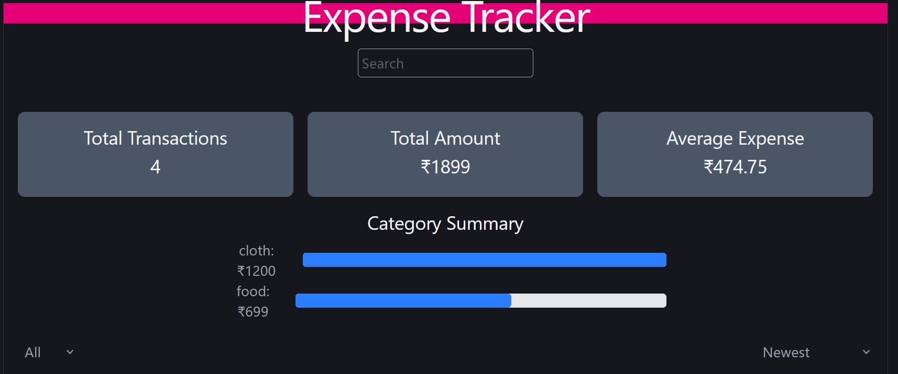
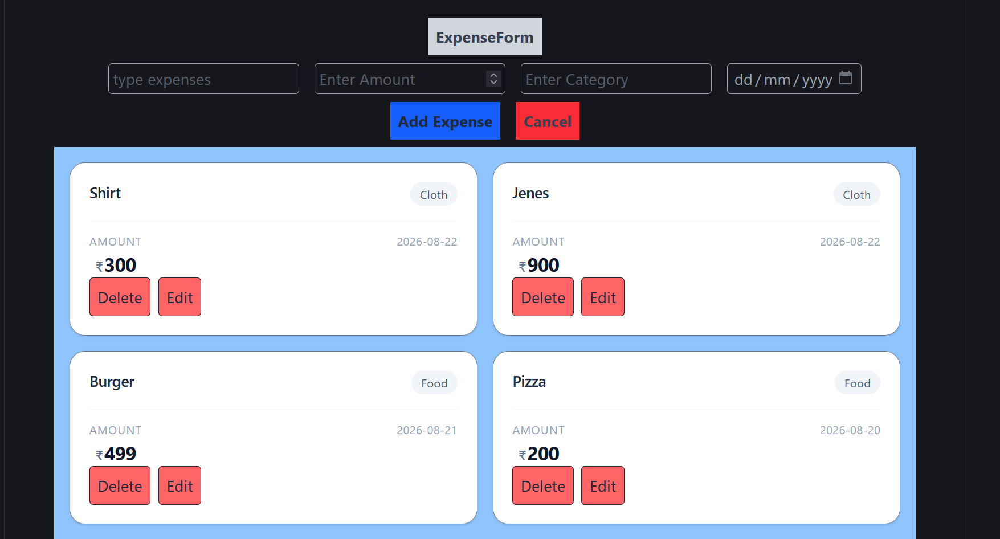
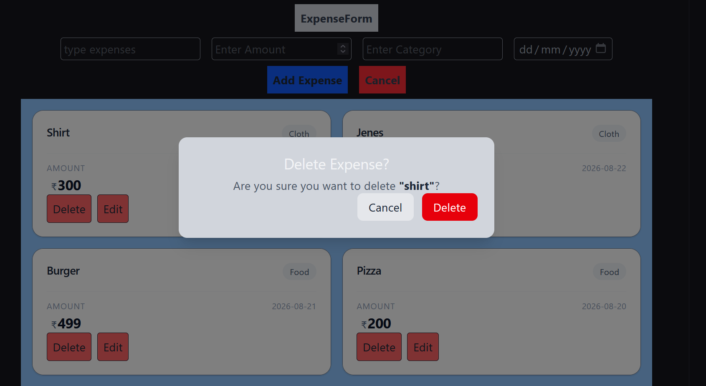

# Expense Tracker

<p align="center">
  <strong>A calm, focused way to see where your money goes.</strong><br />
  Track everyday expenses, uncover spending patterns, and keep your records safely in your browser.
</p>

<p align="center">
  <a href="#live-demo">Live Demo</a> ·
  <a href="#features">Features</a> ·
  <a href="#getting-started">Getting Started</a> ·
  <a href="#project-journey">Project Journey</a>
</p>

<p align="center">
  
  
  
  
</p>

> **Note:** Replace the repository, live-demo, author, and screenshot placeholders below before publishing this project.

## Overview

Expense Tracker is a front-end personal finance dashboard built to make day-to-day spending easier to capture and easier to understand. Add an expense in seconds, find it later with search and filters, and turn a list of transactions into useful category-level insights.

All data stays in the browser through `localStorage`, so the app works without a backend, account, database, or external API.


## Screenshots

Add real images after deployment so visitors can understand the project before opening it.






## Live Demo

**Demo:** [Add your deployed URL here](https://your-live-demo-url.example.com)

**Repository:** [Live link ](https://github.com/Anant23452/Expense-tracker)

## Tech Stack

| Technology | Purpose |
| --- | --- |
| React | Component-based user interface |
| TypeScript | Safer data models, props, and state updates |
| Tailwind CSS | Fast, consistent, responsive styling |
| Browser `localStorage` | Persistent client-side expense records |

## How It Works

The app treats the saved expense list as the single source of truth. The visible list and dashboard metrics are derived from it instead of being saved separately.

```text
User input
    ↓
Validated, controlled form state
    ↓
Expense list state
    ↓
localStorage persistence
    ↓
Derived data pipeline
    ├── search by title/category
    ├── category and month filters
    ├── sorting
    ├── summary metrics
    └── category totals, percentages, and bars
    ↓
Rendered list and dashboard
```

This approach reduces duplicated state and helps ensure the analytics always reflect the current transactions.

## Project Structure

The exact filenames can vary, but the project is organized around a clear separation of UI, shared types, and expense-related logic:

```text
src/
├── components/          # Form, list, filters, summaries, modal, analytics UI
├── types/               # TypeScript expense and category definitions
├── utils/               # Storage and derived-data helpers, when applicable
├── App.tsx              # Main state and composition
├── main.tsx             # Application entry point
└── index.css            # Tailwind directives and global styles
public/
└── screenshots/         # Portfolio screenshots (add before publishing)
```

## Key Concepts Practiced

- **Controlled inputs:** form fields are driven by React state for predictable creation and editing.
- **CRUD flows:** expenses can be created, read in the list, updated, and deleted.
- **Derived state:** filtered results and analytics are calculated from the source expense list rather than stored independently.
- **Data transformation:** transactions move through a deliberate pipeline—filter, search, sort, then render.
- **Type safety:** TypeScript captures the expected expense shape and component contracts.
- **Persistence:** `localStorage` preserves the browser's data between sessions.
- **Safe destructive actions:** a confirmation modal adds an intentional pause before deletion.

## Getting Started

### Prerequisites

- Node.js 18 or newer
- npm (included with Node.js)

### Installation

```bash
git clone https://github.com/Anant23452/Expense-tracker
cd expense-tracker
npm install
npm run dev
```

Open the local URL shown in your terminal (commonly `http://localhost:5173`).

### Available Scripts

For a standard React + TypeScript project setup:

```bash
npm run dev       # Start the development server
npm run build     # Create a production build
npm run preview   # Preview the production build locally
```

If your `package.json` uses different script names, use the commands defined there.


## Future Improvements

These are intentionally not part of the current project scope:

- Add charts for trends over time.
- Add budgets and monthly spending targets.
- Support recurring expenses.
- Export transactions to CSV.
- Add a theme preference, including dark mode.
- Evolve the app into a full-stack version after adding backend skills.


```text
Copyright (c) [2026] [Anant kumar patel]
```

## Author

**[Anant kumar patel]**

- GitHub: [@Anant23452](https://github.com/Anant23452/Expense-tracker)


## Acknowledgements

- React, TypeScript, and Tailwind CSS communities for excellent tools and documentation.
- Everyone who gives thoughtful feedback during the learning process.
- Future you, for turning small daily entries into clearer financial habits.

---

<p align="center">Built with curiosity, clean state management, and a little more awareness of every rupee.</p>
